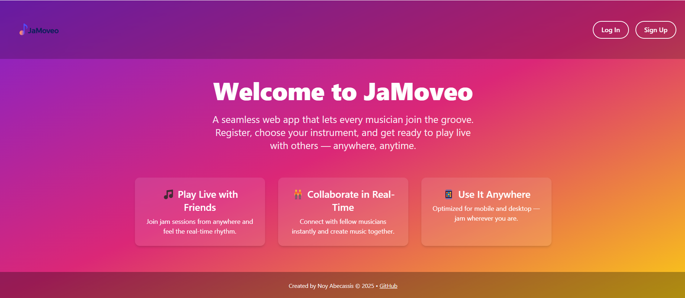
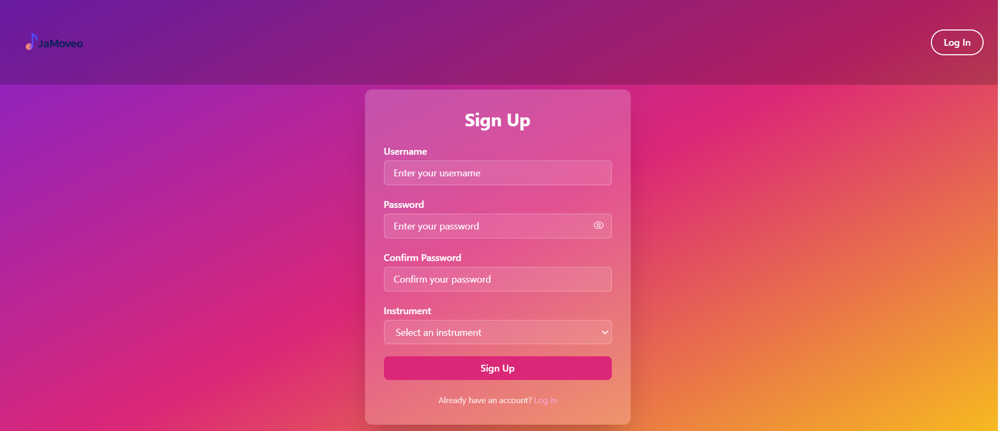
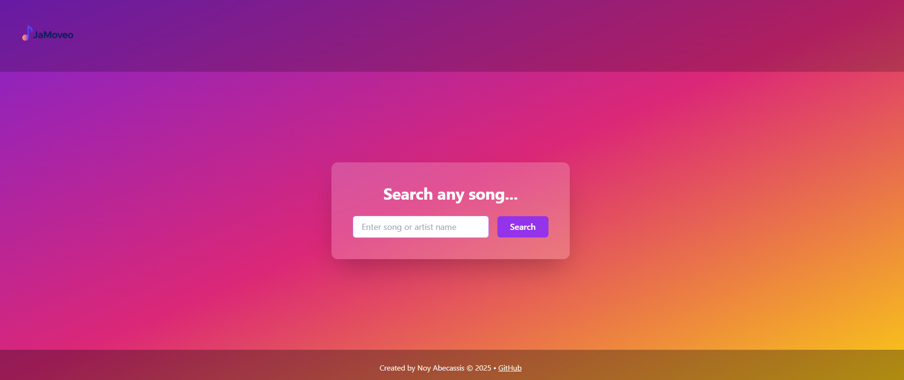
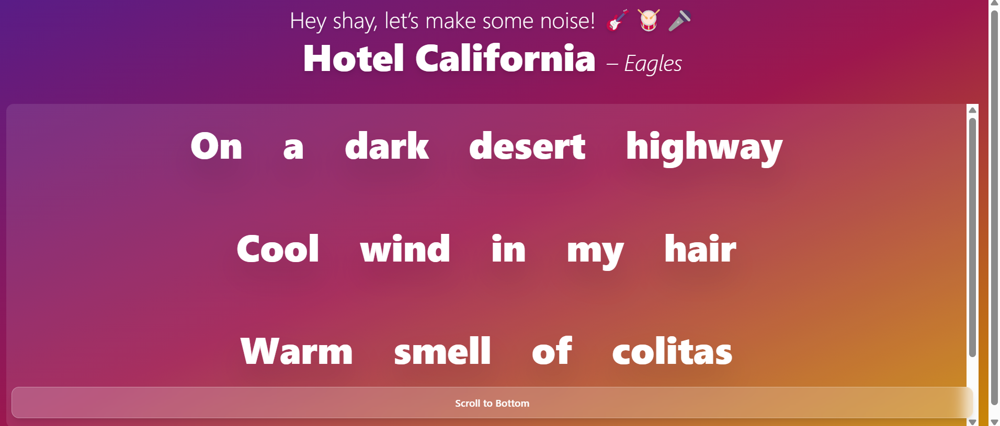
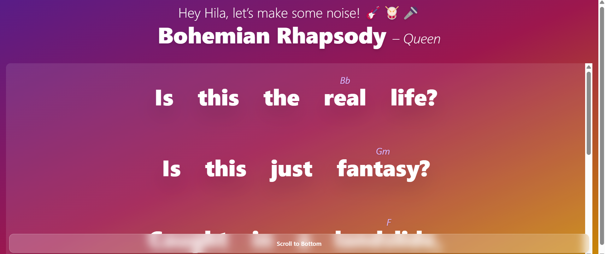
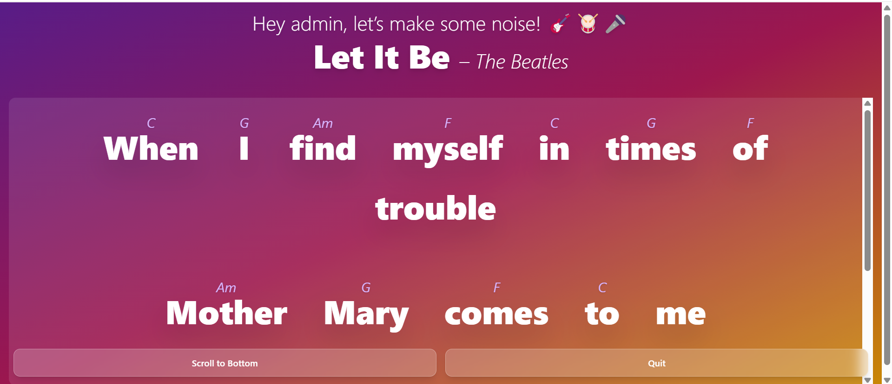

# 🎵 JaMoveo – Real-Time Rehearsal App

**JaMoveo** is a full-stack web app designed for Moveo employees to rehearse music together in real time.  
Musicians and singers can join live sessions, see role-based song views, and stay synchronized thanks to real-time updates via Socket.IO.

---

## 🚀 Features

- 🎤 Role-based login (Admin / Singer / Player)
- 🔍 Admin can search & select songs (English or Hebrew)
- 🎶 LivePage displays:
  - Lyrics + chords (players)
  - Lyrics only (singers)
  - Control panel (admin)
- 🔁 Smooth auto-scroll toggle
- ↩️ Admin “Quit” button resets all users

---

## 🛠️ Technologies Used

- **Frontend**: React, Vite, TailwindCSS, React Router, Axios, Socket.IO-client  
- **Backend**: Node.js, Express, Socket.IO-server, MongoDB (Atlas)  
- **Deployment**: Vercel (Client) + Railway (Server)

---

## 📸 Screenshots

### 🏠 Homepage  

### 📝 Signup Page  

### 🔐 Admin Search  

### 📄 Search Results  

### 🎵 Waiting for Song  

### 🎤 Singer View  

### 🎸 Player View  

### 🛠️ Admin View  

---

## 👩‍💻 Created by

**Noy Abecassis** – 2025  
[GitHub Profile](https://github.com/NoyAvaksis)

